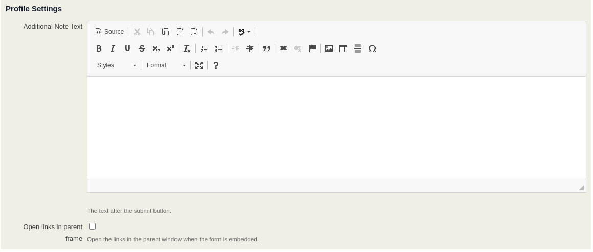
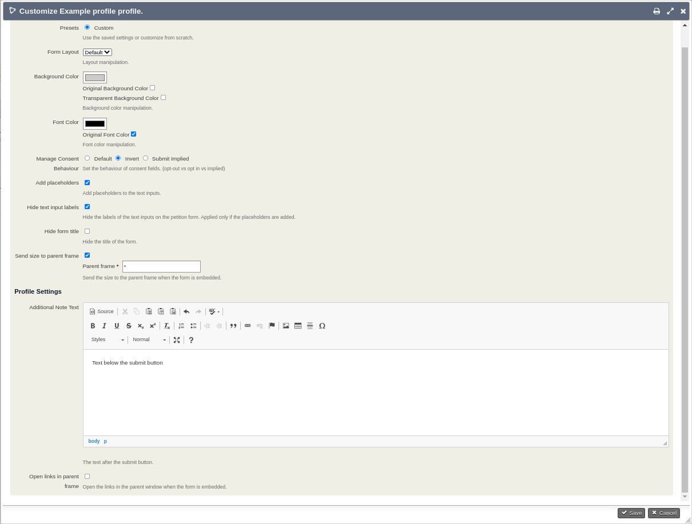
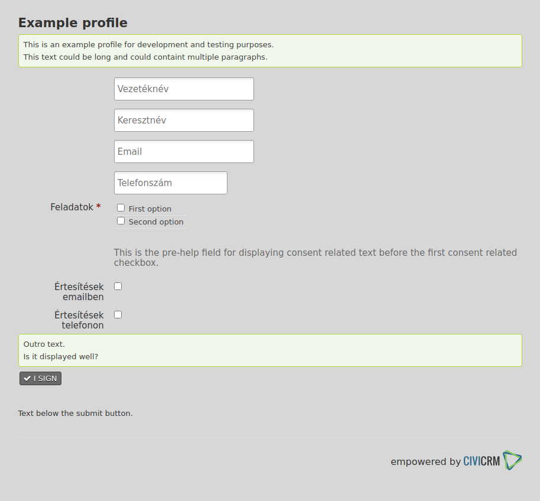
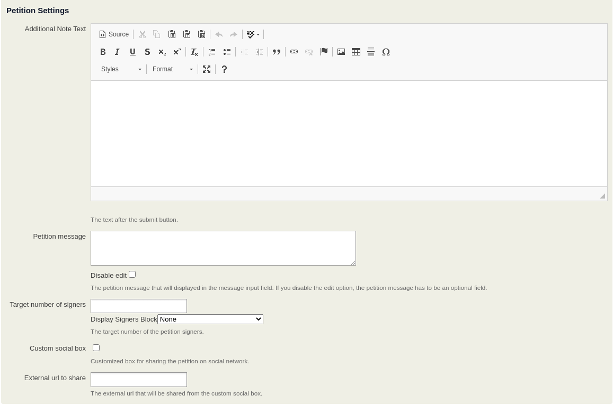
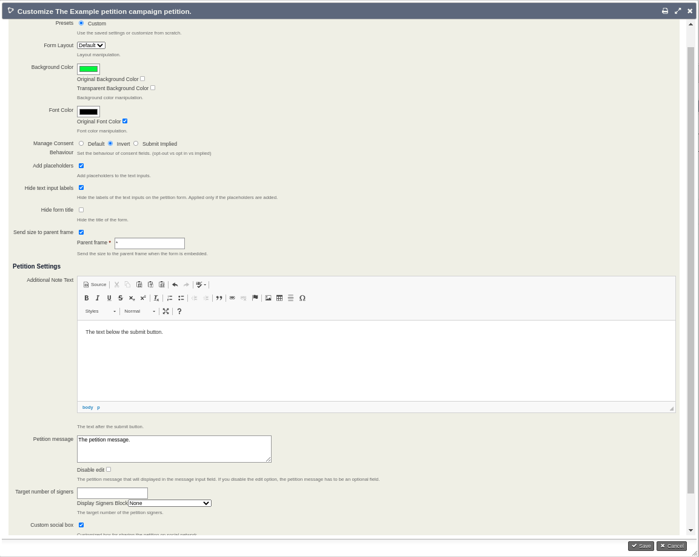
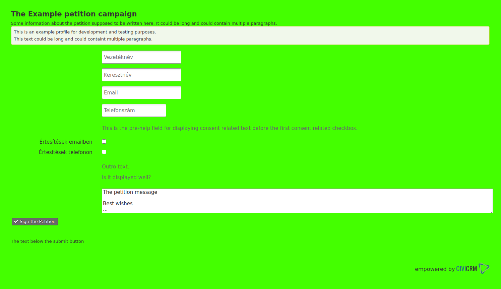
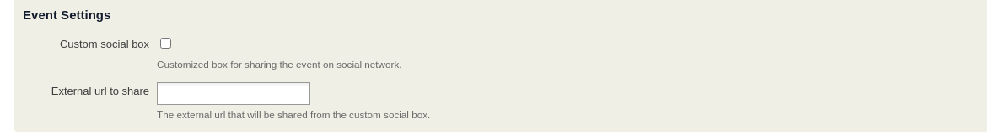

# appearancemodifier

This extension provides an administration interface and functionality to overwrite the layout and the basic styles of the public profile forms, the petition forms, the event forms and the pages that are connected to the forms. The forms could be used as embedded forms on third party pages. The default form layout might be different from the third party site. This extension modifies the html of the forms and adds further css files to be loaded. This tool provides an option for adding formatted and longer default value to a textarea input if it is attached to an activity profile. It could be used as default value for an email like petition message. Possible to use preset configurations and use them on the forms. The translation for hungarian language is included.

The extension is licensed under [AGPL-3.0](LICENSE.txt).

## Requirements

* PHP v7.3+
* CiviCRM v5.37
* [RC-Base](https://github.com/reflexive-communications/rc-base) v0.8.2+

## Installation (CLI, Git)

Sysadmins and developers may clone the [Git](https://en.wikipedia.org/wiki/Git) repo for this extension and
install it with the command-line tool [cv](https://github.com/civicrm/cv).

```bash
git clone https://github.com/reflexive-communications/appearancemodifier.git
cv en appearancemodifier
```

## Hooks

This extension provides hooks, to be able to register further changes on the forms. You can register handler application or preset setting provider application.

### `hook_civicrm_appearancemodifierProfileSettings`

This hook is fired when the customize profile admin form is building. The registered handlers will be appeared on the selector menu. The handler class has to extend the `CRM_Appearancemodifier_AbstractLayout` class. The registered preset will be available on the form. Example hook implementation:

```php
function myextension_civicrm_appearancemodifierProfileSettings(&$handlers)
{
    $handlers['handlers']['My_Profile_Handler_Class_Name'] = 'Profile Handler label';
    $handlers['presets']['My_Profile_Preset_Provider_Class_Name'] = 'Fancy Profile label';
}
```

### `hook_civicrm_appearancemodifierPetitionSettings`

This hook is fired when the customize petition admin form is building. The registered handlers will be appeared on the selector menu. The handler class has to extend the `CRM_Appearancemodifier_AbstractLayout` class. The registered preset will be available on the form. Example hook implementation:

```php
function myextension_civicrm_appearancemodifierPetitionSettings(&$handlers)
{
    $handlers['handlers']['My_Petition_Handler_Class_Name'] = 'Petition Handler label';
    $handlers['presets']['My_Petition_Preset_Provider_Class_Name'] = 'Fancy Petition label';
}
```

### `hook_civicrm_appearancemodifierEventSettings`

This hook is fired when the customize event admin form is building. The registered handlers will be appeared on the selector menu. The handler class has to extend the `CRM_Appearancemodifier_AbstractLayout` class. The registered preset will be available on the form. Example hook implementation:

```php
function myextension_civicrm_appearancemodifierEventSettings(&$handlers)
{
    $handlers['handlers']['My_Event_Handler_Class_Name'] = 'Event Handler label';
    $handlers['presets']['My_Event_Preset_Provider_Class_Name'] = 'Fancy Event label';
}
```

## Forms

The form customization is based on additional settings that could be reached from a new menu link. The additional settings are stored in managed entities.

### General settings

- Form Layout - It is the option for extending the template resources and implementing the alterContent for creating further custom changes on the forms.
- Background Color - If the Original Background Color is unchecked, this value will be used as background color on the form. If the Original Background Color is unchecked and the Transparent Background Color is checked, then transparent background will be applied on the form (included the text inputs, their background color will be set to white and color to black on case of focus state).
- Font Color - If the Original Font Color is unchecked, this value will be used as font color on the form.
- Invert Consent Fields - If it is checked, the consent fields (`do_not_email`, `do_not_phone`, `is_opt_out`) will behave as opt in fields. **Deprecated!**
- Consent Field Behaviour - It provides 3 options. Default (opt-out consent fields), invert (opt-in consent fields), submit implied (set do\_not\_phone and is\_opt\_out to false after form submit).
- Add placeholders - If checked, the text inputs will contain placeholder attributes. The value of the placeholder will be the same as the label of the text input.
- Hide text input labels - Only applied when the Add placeholder also applied. If checked the labels of the text inputs will be hidden.
- Hide form title - If this flag is set, the titles will be hidden on the forms and pages.
- Send size to the parent window - When the form is embedded, with this option the size of the form will be sent with javascript method to the parent window.
- Send size to this parent window - When the form is embedded, with this option the size of the form will be sent with javascript method to this parent window. (default: `*`)

**General Settings**


### Consent activity extension

If the consentactivity extension is also installed, an additional feature also available on the admin forms. You can trigger activities if a pseudo privacy field is checked on the form. The pseudo privacy field - activity map settings is visible if the following conditions met:

- The consentactivity extension is installed and enabled.
- At least one pseudo privacy field is configured on the consentactivity settings form.
- The current form contans at least one pseudo privacy field on the connected profiles.

**Activity map**


### Profile

The AppearancemodifierProfile entity stores the settings for a profile.

**Profile Customization Menu**


**Profile Customization Settings**


- Additional Note Text - This text will be displayed below the submit button.
- Base target is the parent - With this setting, the base target of the links will be set to parent frame if the form is embedded.

**Profile Settings Example**


**Profile Form Example**


### Petition

The AppearancemodifierPetition entity stores the settings for a petition.

**Petition Customization Menu**


**Petition Customization Settings**


- Additional Note Text - This text will be displayed below the submit button.
- Petition Message - This text will be added as default text in the petition message field in the activity profile.
- Disable petition message edit - This prevents the contacts to edit the petition message input field. In this case the petition message has to be optional in the form.
- Target number of signers - This value is used in the progressbar as maximum.
- Display signers block - How to display the current number of signers (just the number, or progressbar when the target number is also set) and where (top, bottom, don't display).
- Custom social box - The sharing options will be replaced with a custom one, that only contans twitter and facebook share option.
- External url to share - This url will be shared from the social boxes. Only applied when the custom social box also applied.

**Petition Settings Example**


**Petition Form Example**


### Event

The AppearancemodifierEvent entity stores the settings for an event.

**Event Customization Menu**


**Event Customization Settings**



- Custom social box - The sharing options will be replaced with a custom one, that only contans twitter and facebook share option.
- External url to share - This url will be shared from the social boxes. Only applied when the custom social box also applied.

**Event Settings Example**


**Event Info Example**


**Event Form Example**


**Event Confirm Example**


**Event Thank You Example**


## Layouts

The functionality of this extension could be extended with further custom layouts. The Layout class has to extend the `CRM_Appearancemodifier_AbstractLayout` class.

### Abstract layout

The constructor receives the class name of the given page or form and stores it in a class variable.
The setStyleSheets method is called at that points when the pages could be extended with further css resources. If you need a specific rule on a specific page, use the currentClassName variable for detecting the page.
The alterContent method is called after the SSR process of a template and ready for the manipulation.
The className method is a handy helper class that provides you a classname prefix, that could be used for writing css rules.

### Layout implementations

- Extend your class from the `CRM_Appearancemodifier_AbstractLayout` class.
- Implement the setStyleSheets method. It can be empty if you don't need additional css rules to be applied.
- Implement the alterContent method. Manipulate the DOM as you want. The phpQuery is a handy tool for it. If you have custom css rules, don't forget to apply the uniq classname on the main element (#crm-container).

### Possible manual fixes

If someone creates a profile, petition or event during the install process, it is possible thai it will be skipped from the update process. In this case the appearance modified entity entry has to be created manually (eg: api explorer).

## Changes

Log of the changesets since v3.1.2. To be able to see when do we need to execute database updates.

- In v.3.2.0 the display of the petition signers feature has been implemented. The signers block could be displayed on the top or on the bottom position of the petition. It could display the current number of the signers or a progress bar with the current number and the expected number of signers.
- In v3.2.1 the fix for the skipped modified profile entries has been implemented, an upgrader process is provided for creating the missing entries.
- In v3.3.0 The consent field behaviour has been extended. 2 new database fields were applied on the entities that stores it (consent\_field\_behaviour, custom\_settings). The invert\_consent\_fields bool option has to be removed later as the behaviour field is getting used.
